# Dark Age

This is the theme I developed for myself, as I tend to work late at night and prefer dark themes, so I figured I'd go ahead and share it should it be desired!

##### 08.05.20
* added customization for global width through variables to reduce left/right padding (--reduce-padding-left, --reduce-padding-right)
* added dropdown menu styling variables
* added kanban card styling variables
* lots of minor coloring and font fixes

##### 06.24.20
* updated to variable system for easily customizing theme colors
* updated to importation of .css file from https://shodty.github.io/Dark_Age.css
* added clearer instructions for implementation and customization.
* additional commenting

# Instructions for Installation

## Option #1:
[Copy the CSS from here!](https://github.com/shodty/Roam_Dark_Age/blob/master/Dark_Age_of_Roam.css) and paste it into your roam/css page. 

This works by linking to an outside .css file, actually located [here](https://shodty.github.io/Dark_Age.css) to handle all the styling, as it keeps the roam/css page much cleaner/faster. 

If you do in fact want to manipulate the code, just [navigate to the source .css file](https://shodty.github.io/Dark_Age.css) manually, copy it, and paste it all into your roam/css page. 

Alternatively, to further customize, you can actually just add your own rules below the :root {}, and it will supercede everything before it if it is targeted with appropriate specificity/importance.

### How to setup your roam/css page:

[Applying custom themes in Roam Research](https://www.youtube.com/watch?v=UY-sAC2eGyI)

## Option #2:
Another method is using the [Stylus](https://chrome.google.com/webstore/detail/stylus/clngdbkpkpeebahjckkjfobafhncgmne?hl=en) Chrome Extension to override the page css. If you are using that method, [copy the CSS from here](https://shodty.github.io/Dark_Age.css) and paste it into Stylus, and set it up to apply to Roam Research urls.

# Variables for Customization

Both options allow for customizing colors by changing the color values included at the top of the file. I did my best to comment everything with what exactly it will shift.

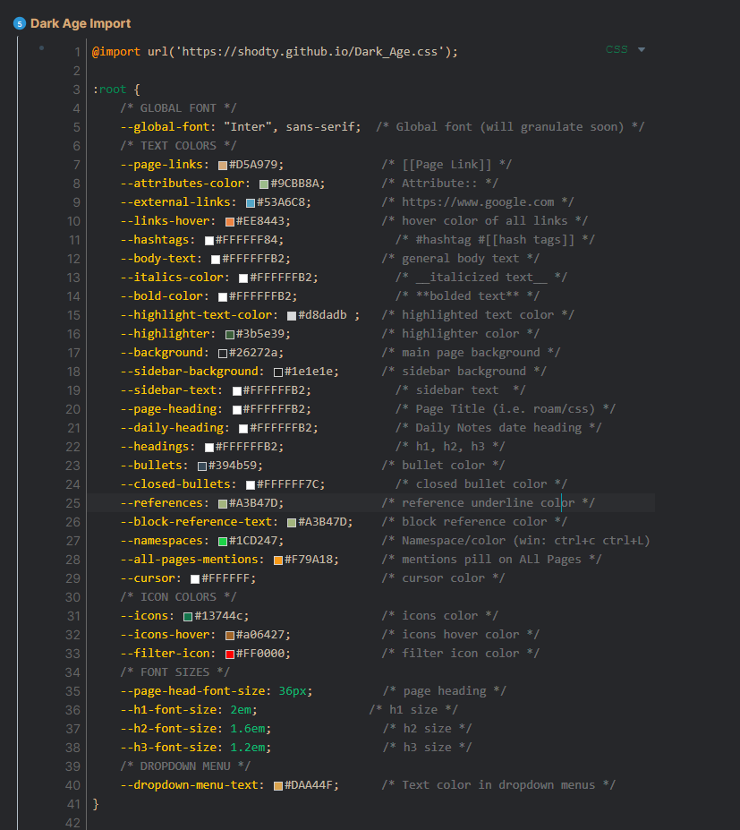

Please feel free to reach out if you have any questions/suggestions/requests!

Thanks!

# Screenshots

## Main Styling
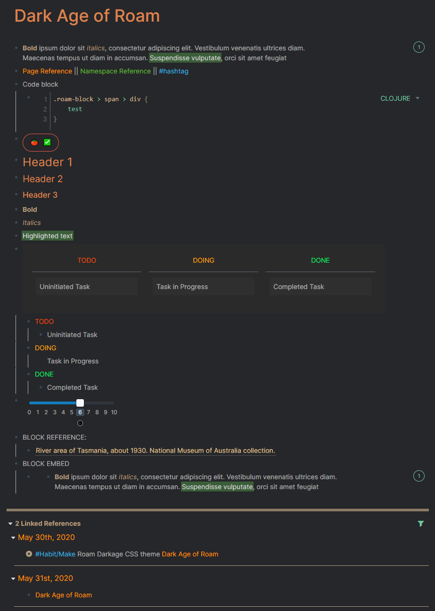
## Daily Page
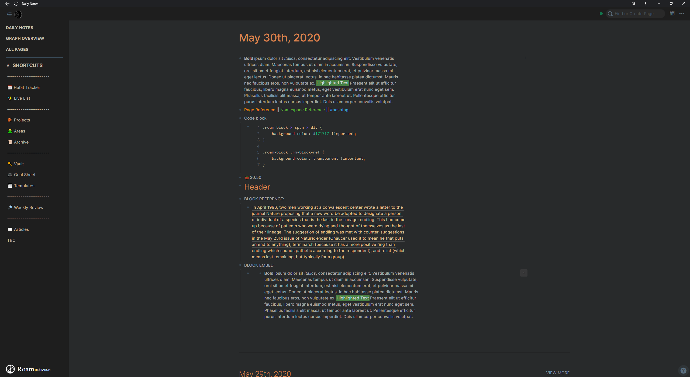
## Full Page Look
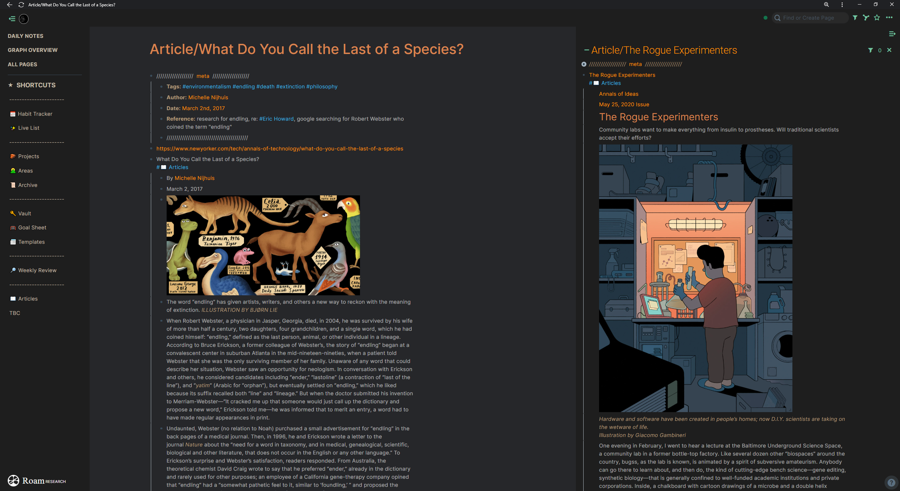
## Side bar
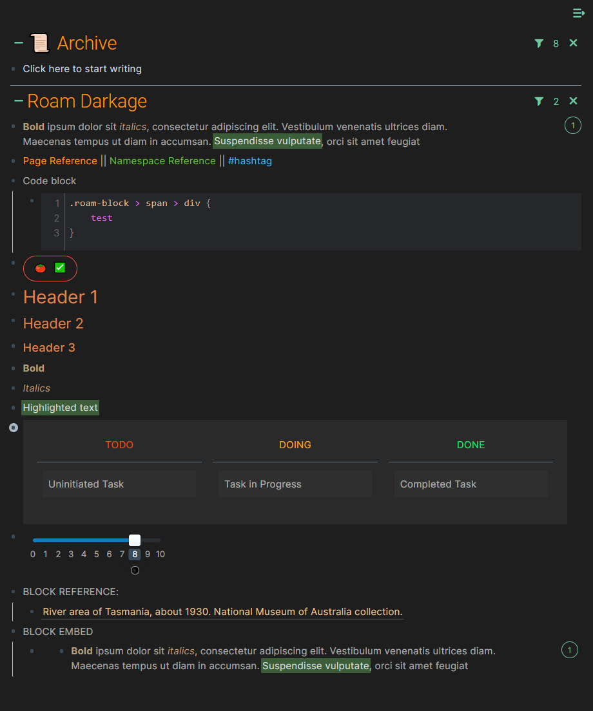
## Left Bar
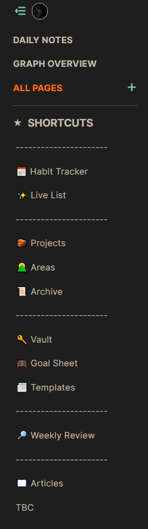
## Article
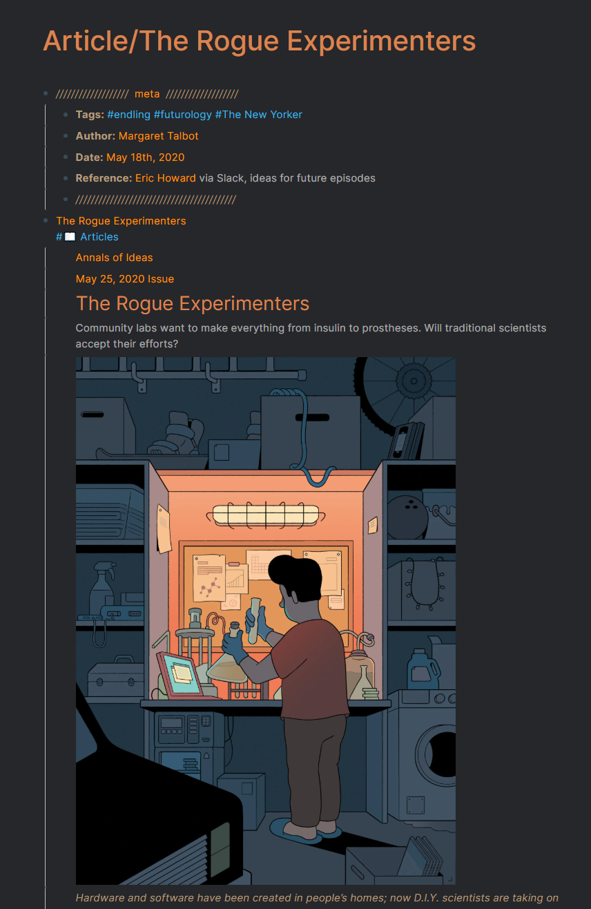
## Table
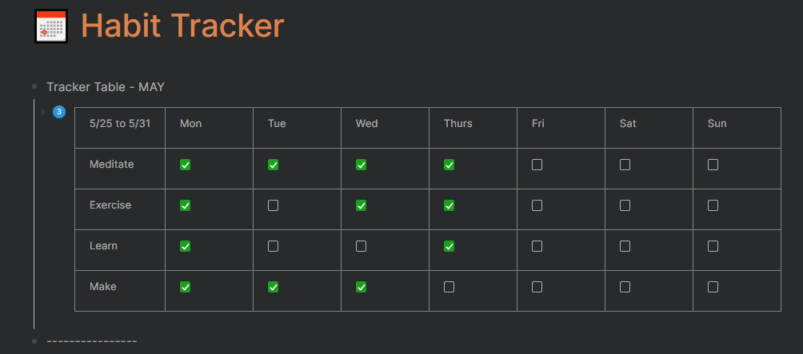
## All Pages Section
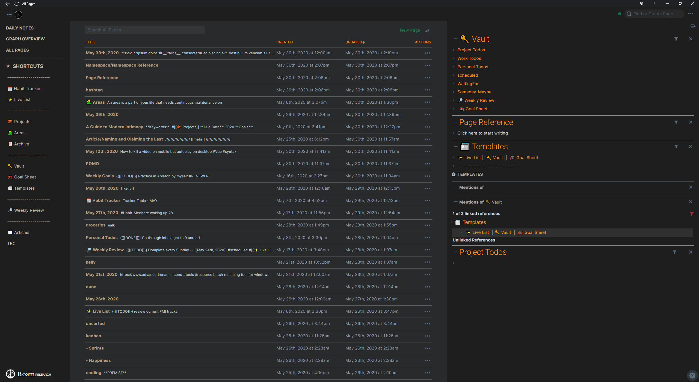
## Graph
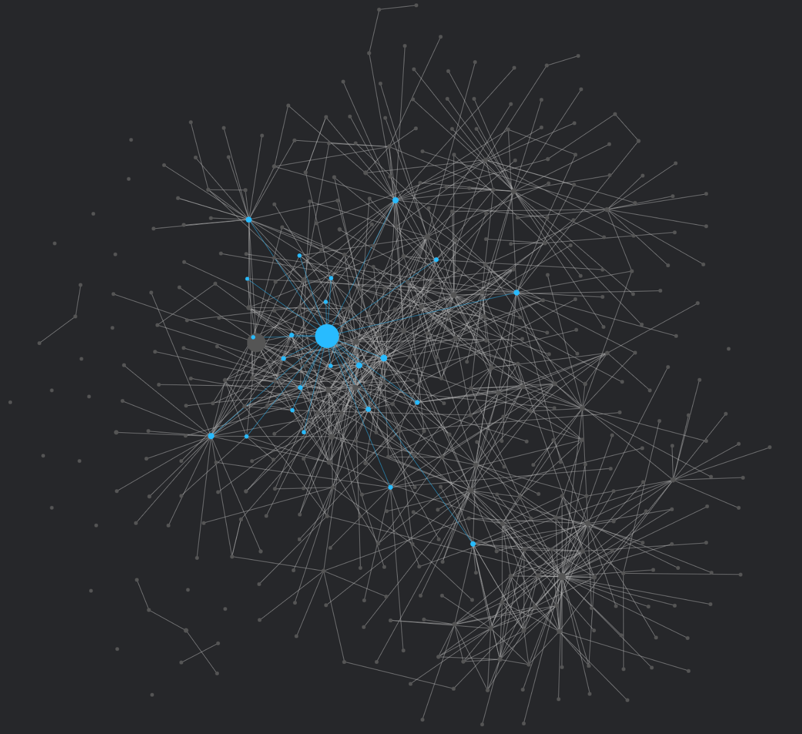
## Graph Overview
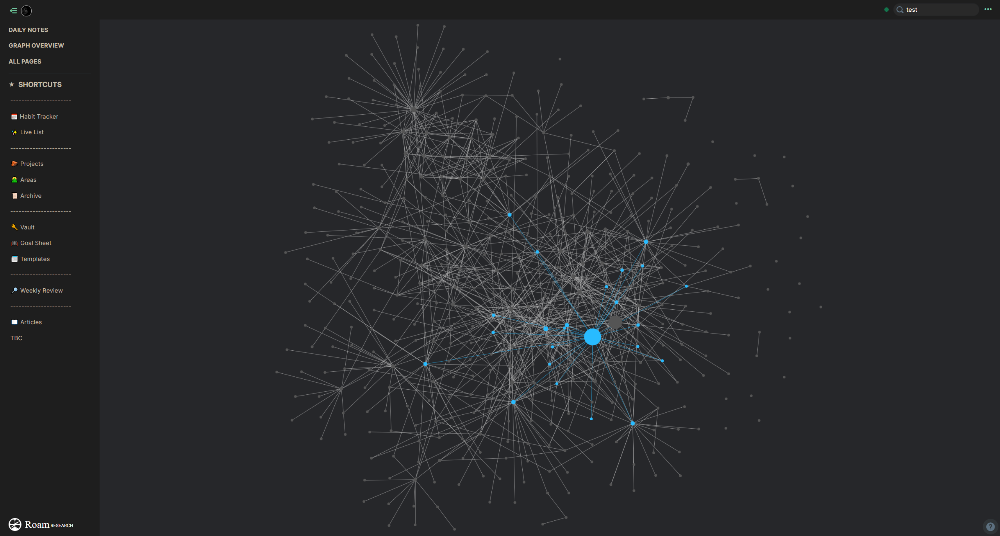
